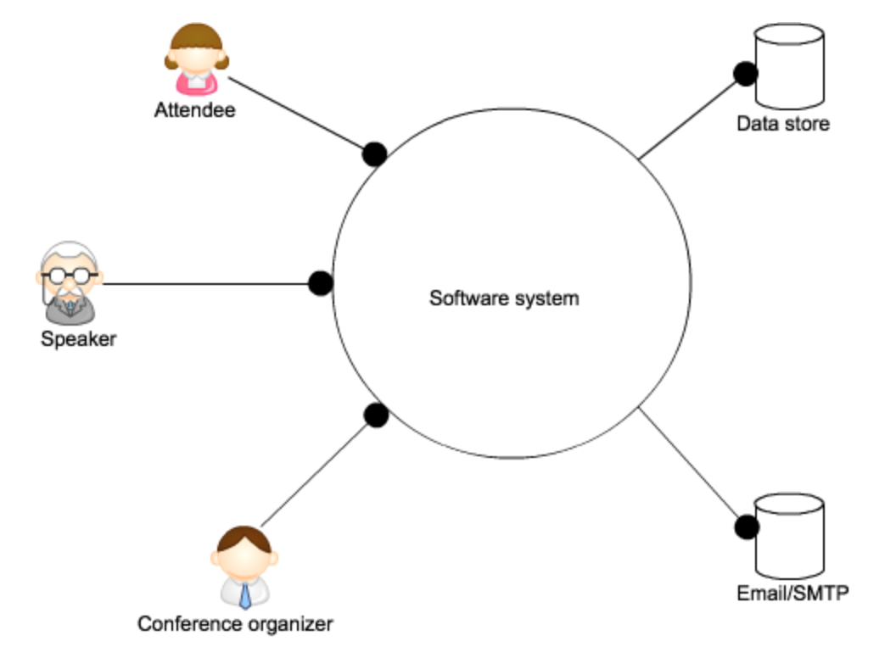

# Requirements Analysis
A stepwise slicing of requirements. Each slice covers a smaller scope in terms of functional and non-functional requirements.

## The whole software system
The whole software system is used by users in three different roles. Roles depend on the sofware system:

* Attendees give feedback to sessions
* Speakers receive feedback
* Conference organizer sets up a conference with its sessions for feedback - and checks feedback

The software system on the other hand depends on a couple of resources:

* Sessions and feedback needs to be stored in some kind of persistence medium
* Speakers and attendees are notified by email

Sooner or later details about how system and context/environment communicate have to be determined, e.g. paradigms, API/frameworks, products to use. But not yet :-)

## Applications
For each role the question is, how does it work with the software system. Do all roles use the same application (entry point, VS project) or are their different applications for each role?

The latter could be very naturally the case if the roles used different devices.

But how about this for a start:

* Speakers only get emails from the system.
* Conference organizers register conferences with all their sessions by uploading a CSV file.
* Attendees give feedback through a web application with several pages (aka dialogs).

## Dialogs

## Interactions