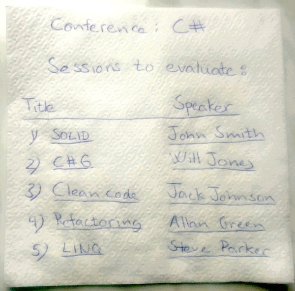
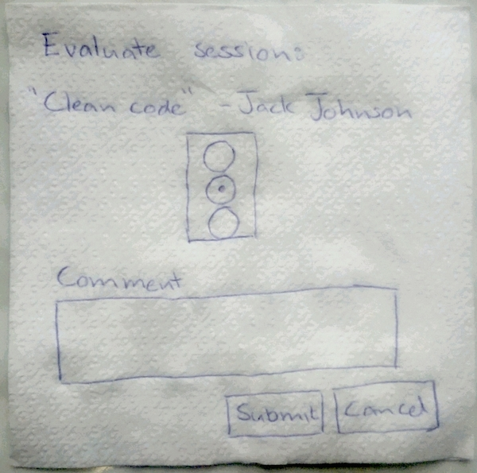

# Requirements Analysis
A stepwise slicing of requirements. Each slice covers a smaller scope in terms of functional and non-functional requirements.

## The whole software system
The whole software system is used by users in three different roles. Roles depend on the sofware system:

* Attendees give feedback to sessions
* Speakers receive feedback
* Conference organizer sets up a conference with its sessions for feedback - and checks feedback

The software system on the other hand depends on a couple of resources:

* Sessions and feedback needs to be stored in some kind of persistence medium
* Speakers and attendees are notified by email

Sooner or later details about how system and context/environment communicate have to be determined, e.g. paradigms, API/frameworks, products to use. But not yet :-)

## Applications
For each role the question is, how does it work with the software system. Do all roles use the same application (entry point, VS project) or are their different applications for each role?

The latter could be very naturally the case if the roles used different devices.

But how about this for a start:

* Speakers only get emails from the system.
* Conference organizers register conferences with all their sessions by uploading a CSV file.
* Attendees give feedback through a web application with several pages (aka dialogs).

## Dialogs

### Conference organizer application
There need only be a very simple way to upload a CSV file. For a start the name of the file can be structured like this:

    conferenceId "-" conferenceTitle ".txt"

Example:

    dw15 - Developer Week 2015.txt
    
Each line of the CSV file describes a single session of the conference. Columns needed:

* Session id, e.g. t1s1
* Session title, Introduction to Flow Design
* Session starting time, e.g. 2015-04-10T10:00:00
* Session ending time, e.g. 2015-04-10T10:45:00
* Speaker name, e.g. Ralf Westphal
* Speaker email address, e.g. info@ralfw.de

The first line will be assumed to be column headlines. Columns will be separated by a single TAB.

For a start files are assumed to be always wellformed.

### Attendee feedback application
Attendees enter the website through some root URL, e.g. presentationfeedback.com or presentationfeedback.apphb.com. This root URL will be abbreviated with / from here on.

#### Home /
The homepage shows the sessions of a particular conference. To identify the conference its id needs to be passed to the page, e.g. _/dw15_ or _/?conferenceid=dw15_.

Clicking on a session title leads to the feedback page for that session.

All sessions of the conferences should be listet, but only the ones where feedback can actually be given should be selectable.

Sessions could be grouped according to date and should be sorted according to starting time.

#### Feedback /feedback
On the feedback page the attendee identifies himself with his email address, selects a session score (traffic light) and optionally enters a comment.

When calling the page the conference and the session need to be identified. This data could be passed using query params, e.g. _/feedback?conferenceid=dw15&sessionid=t1s1_.

Submitting the feedback leads back to the conference homepage. _A cancel button does not seem to be necessary; the same effect can be reached by backspacing to the previous page._

## Interactions