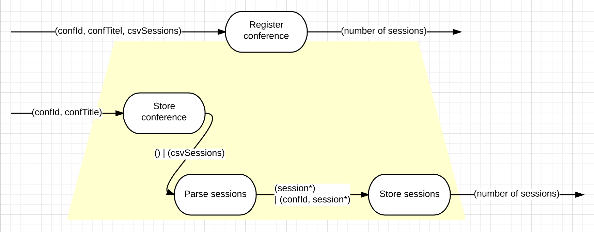

# Solution Design
For each (smallest) increment identified during requirements analysis a flow design and class design is done.

# Persistence in General
Persistence of data will be achieved by using an EventStore (ES).

# coapp/upload (command)
Uploading a conference stores the data provided in a CSV file in the ES. Events are:

* **ConferenceRegistered**, context: conference id, payload: conference title
* **SessionRegistered**, context: session id, payload: session title, starting time (YYYY-MM-DDTHH:MM:SS), ending time (YYYY-MM-DDTHH:MM:SS), speaker name, speaker email address
* **SessionAssigned**, context: conf. id, payload: session id

Signature of interaction function:

	int RegisterConference(string id, string title, string csvSessions)

The return value is the number of sessions registered.

The _csvSession_ param contains the contents of the CSV file uploaded. Getting the data from the file (possibly a stream) is the responsibility of the _Head_.

## Flow Design
The process can initially look like this:

No checks for existence of conference and/or sessions. If the same conference gets uploaded several times it will be added several times. No harm done to already given feedback.

This behavior can be used to upload conferences in multiple chunks.

No deletion of sessions possible this way.

## Class Design
For now storing of conference and sessions can be done by the same class. Let's call it _Repository_.

Parsing the sessions will be done by a _CSVParser_. It does not need to be specific. No need to introduce domain data types yet.

Integration is the responsibility of the _Body_.

## Library Design
_Repository_, _CSVParser_, and _Body_ can go into the _coapp.body_ library.

The _Head_ should be separated into _coapp.head.console_ which can be started from the console.